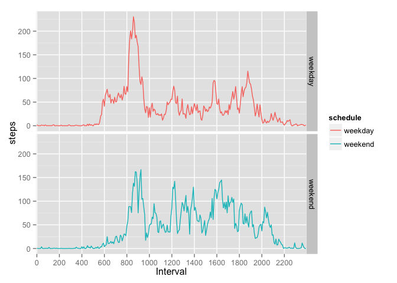

# Reproducible Research: Peer Assessment 1
Peter Chines  

## Introduction

It is now possible to collect a large amount of data about personal movement
using activity monitoring devices. This document describes some features of a
dataset taken from such a device, which includes total number of steps taken
at five-minute intervals over the course of two months--October and November,
2012.  The data are available [on the
web](https://d396qusza40orc.cloudfront.net/repdata%2Fdata%2Factivity.zip)
and in the
[github repository](https://github.com/pchines/RepData_PeerAssessment1).

## Loading and preprocessing the data

The data is in a compressed comma-delimited file, and can be read into a
dataframe with this R command:


```r
raw <- read.csv(unzip("activity.zip"))
nas <- sum(is.na(raw$steps))
intvs <- nrow(raw)
```

No preprocessing of the data are required, but note that dates are strings in
YYYY-MM-DD format, and interval labels are integers consisting of values
composed of hour * 100 + minute.  None of the labels, but 2304 of the step
counts (13.1%) are missing (NA).

## Steps per day

The mean and median number of steps per day (ignoring missing values) can be
calculated, and a histogram shows the distribution of values:


```r
by.day <- aggregate(steps ~ date, raw, sum)
mn.day <- mean(by.day$steps)
md.day <- median(by.day$steps)
library(ggplot2)
qplot(steps, data=by.day, geom="histogram", binwidth=1000)
```

 

The mean number of steps per day is 10766.2, and the median
is 10765.

## Average daily activity pattern

The average daily activity pattern can be seen by taking the mean for each
interval across all days (again, ignoring missing values):


```r
by.int <- aggregate(steps ~ interval, raw, mean)
max <- max(by.int$steps)
max.intv <- by.int[which(by.int$steps == max), "interval"]
qplot(as.factor(interval), steps, data=by.int, geom="line",
    group="Average Daily Pattern") +
    scale_x_discrete(name="Interval", breaks=seq(0,2400,by=200))
```

 

The average daily interval with the maximum number of steps is 835,
with an average of 206.1698113 steps over the two-month period.

## Imputing missing values

Missing values can confound some analyses.  In order to assess the effect of
missing values on this data set, we will impute those missing data, replacing
them with the mean daily number of steps for that interval.  This will be
a reasonable strategy if the daily pattern for our individual is relatively
stable.


```r
act <- merge(raw, by.int, by="interval")
act$steps <- ifelse(is.na(act$steps.x), act$steps.y, act$steps.x)
```

After imputing the missing values, we can once again look at the daily
pattern of activity:


```r
act.day <- aggregate(steps ~ date, act, sum)
amn.day <- mean(act.day$steps)
amd.day <- median(act.day$steps)
qplot(steps, data=act.day, geom="histogram", binwidth=1000)
```

 

After imputing missing values, the mean is 10766.2 steps
per day, and the median is 10766.2 steps per day.

## Are there differences in activity patterns between weekdays and weekends?

Using these imputed data, we can assess whether there are different activity
patterns between weekdays and weekends (assuming that this individual has a
normal Monday through Friday workweek):


```r
act$wday <- weekdays(as.POSIXlt(as.character(act$date)), abbrev = TRUE)
act$schedule <- "weekday"
act$schedule[act$wday=="Sun" | act$wday=="Sat"] <- "weekend"
act.int=aggregate(steps~interval+schedule,act,mean)
qplot(as.factor(interval), steps, data=act.int, geom="line",
    facets=schedule~., group=schedule, color=schedule) +
    scale_x_discrete(name="Interval", breaks=seq(0,2400,by=200))
```

 

There are noticeable differences in activity patterns between weekdays and
weekends: weekdays, activity typically begins just before 6am, peaks around
8:30am, and stays at a fairly low level the rest of the day; on weekends, the
onset of activity begins later, around 8am, and generally is at a higher level
during the day, and extends further into the evening, dropping off around 9pm.
These differences suggest that missing-value imputation would be more accurate
if performed separately for weekdays and weekends.  It also indicates that
analysis of long-term changes in daily activity should take these distinct
patterns into account.

